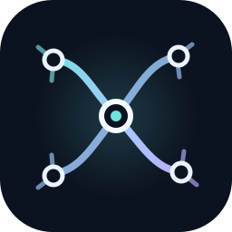

<p align="center">
  
</p>

<p align="center"><strong>Explore your music, spatially.</strong></p>

<p align="center"><a href="docs/README.md">Docs</a> · <a href="docs/FIRST_CONTRIBUTION.md">Contribute</a> · <a href="SUPPORT.md">Support</a></p>

<p align="center">
  <a href="https://github.com/DasManPack/chiasm/releases/tag/v0.1.2"><strong>Download Chiasm v0.1.2</strong></a> ·
  <a href="docs/CHIASM.md">How Chiasm works</a> ·
  <a href="docs/TESTING.md">Test Chiasm</a> ·
  <a href="docs/CHIASM_CAMPAIGN.md">Development notes</a>
</p>

# Chiasm

Chiasm is an experimental project about exploring a music collection as a place. Albums become landmarks in a navigable visual field. You move through the collection, focus on an album, and follow relationships when you choose. Detail appears with attention; most of the time, the collection itself is the interface.

The aim is **music exploration with very little permanent text**: less managing lists and screens, more noticing where you might go next.

## A separate experiment, built from Melodex

Chiasm is a distinct project derived from the open-source [Melodex](https://github.com/Cliff-Lee/melodex) codebase. It is not a Melodex release or a renamed copy. The experiment reuses Melodex's local library, artwork cache, and playback foundations while developing a different, spatial-first interaction model. Melodex remains a separate project.

This preview retains inherited Melodex modules internally, including pages and technical names that support compatibility. Chiasm launches directly into its spatial field; those inherited pages, menus, and shortcuts are removed from the visible Chiasm experience. The public identity, launcher, app window, and test packages are Chiasm.

## Try the public preview

Download [Chiasm v0.1.2](https://github.com/DasManPack/chiasm/releases/tag/v0.1.2) for macOS, Windows, Linux, or Android. On macOS, open the DMG and move Chiasm to Applications; on Windows, run the installer or portable app. For Ubuntu or Debian, use the `.deb`; other compatible x86_64 Linux systems can use the AppImage. The Android app is an early bridge companion for a desktop host.

This is an experimental public preview, not a stable release. The macOS builds are not notarized and Windows builds are not code signed. First-use, accessibility, real-library playback, and human discovery-loop checks remain in progress. Your audio files stay where they are.

Platform notes: [Linux](docs/INSTALL_LINUX.md) · [macOS](docs/INSTALL_MACOS.md) · [Windows](docs/INSTALL_WINDOWS.md) · [Android](docs/INSTALL_ANDROID.md).

### Android companion

The [Android workflow](https://github.com/DasManPack/chiasm/actions/workflows/android.yml) produces `Chiasm-Android.apk` and `Chiasm-Android.aab`. The app now has Chiasm's name, icon, and separate Android package identity. Its current Android experience is still an early bridge companion that connects to a Chiasm desktop host; the spatial collection field is currently desktop-focused.

## Run the isolated field prototype

The repository also contains a small standalone field demo with fictional albums and mock playback:

```bash
cd desktop
python -m chiasm.run
```

For the integrated test app, see [build and test instructions](docs/CHIASM.md).

## Project principles

- The collection is the interface.
- Keep the field calm and legible; motion follows user intent.
- Reveal labels and controls when they help with a decision.
- Show why a relationship exists; screen distance alone is not evidence.
- Keep local music local and make optional services clear.
- Prefer responsiveness and spatial memory over visual effects.

## Lineage and licence

Chiasm's original spatial field work is combined with software derived from Melodex. The inherited code and third-party components retain their existing notices and licences; see [LICENSE](LICENSE) and [THIRD_PARTY_NOTICES.md](THIRD_PARTY_NOTICES.md). Chiasm-specific contributions are distributed under the MIT licence as well.

## Contributing

See [CONTRIBUTING.md](CONTRIBUTING.md) for the development setup, the [developer quickstart](docs/DEVELOPER_QUICKSTART.md), [project status and stability](docs/developers/00_STATUS_AND_STABILITY.md), and the [ecosystem architecture](docs/developers/01_ECOSYSTEM_ARCHITECTURE.md). Please frame product ideas around spatial music exploration and explain how they fit the principle: **will this still make sense as a lens inside the collection?**
